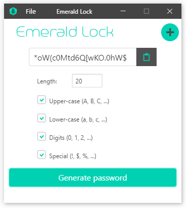
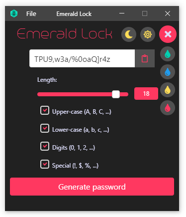

   

   

   

   

### What it offers

<ul>
  <li> simple interface, but with a nice bulma style </li>
  <li> generates passwords with a length from 8 to 20 </li>
  <li> the generated password can contain:
    <ul>
      <li> upper case letters :capital_abcd: </li>
      <li> lower case letters :abcd: </li>
      <li> digits :1234: </li>
      <li> symbols :symbols: </li>
    </ul>
  <li> copy password to cliboard with a simple click on :clipboard: </li>
</ul>

### Installation

For now, the app is available only for Windows, but in the future you should be able to use it on Linux and Mac.

#### Windows

<ul>
  <li> Microsoft Windows Installer package:
    <a href="https://github.com/xylish7/emerald-lock/releases/download/v1.4.0/emerald-lock-1.4.0.msi"> Emerald Lock.msi </a>
  </li>
  <li> Exe setup: 
    <a href="https://github.com/xylish7/emerald-lock/releases/download/v1.4.0/emerald-lock-setup-1.4.0.exe"> Emerald Lock.exe </a>
  </li>
</ul>
